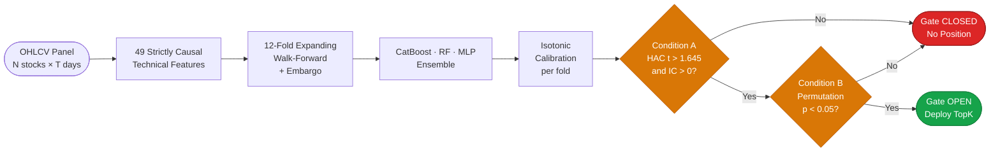

# When the Gate Stays Closed

### Empirical Evidence of Near-Zero Cross-Sectional Predictability in Large-Cap NASDAQ Equities Using an IC-Gated Machine Learning Framework

**Rajveer Singh Pall** · Department of Computer Science and Business Systems, Gyan Ganga Institute of Technology and Sciences, Jabalpur, India · rajveerpall04@gmail.com

<p align="left">
  <a href="https://www.python.org/"></a>
  <a href="LICENSE"></a>
  
  
  
  
</p>

> **Under review at *Quantitative Finance and Economics* (AIMS Press) — Q1 Web of Science (JCI), ESCI, Scopus, EconLit.**

---

## Overview

This repository accompanies the paper introducing the **IC-Gated Deployment Framework (ICGDF)**: a two-stage conjunctive statistical filter that requires simultaneous satisfaction of a HAC Newey-West t-test and a distribution-free permutation confirmation before any capital is deployed from a cross-sectional ML ranker. The gate formalises the informal IC threshold practice of Grinold and Kahn (1999) into a statistically rigorous conjunctive test, reducing the null false positive deployment rate from **11.8%** (naive t-test) to **0.0%** under AR(1) null conditions.

Applied to a CatBoost + Random Forest + MLP ensemble on 30 survivorship-bias-mitigated NASDAQ-100 stocks over 1,512 consecutive out-of-sample trading days (October 2018 – October 2024), **the gate never opened — not once across 12 walk-forward folds.** The ensemble achieves ECE < 0.025 across all folds, demonstrating that strong probability calibration does not imply cross-sectional discriminative content. A cross-market replication on 20 Nifty 50 large-cap equities confirms the gate-closed result extends to the Indian market.

---

## ICGDF Pipeline



Both conditions must be satisfied simultaneously. If either fails, no position is taken.

---

## Key Results

### Primary Finding — NASDAQ-100 (30 stocks · 12 folds · 1,512 OOS days)

| Test | Value | Threshold | Decision |
|:-----|------:|----------:|:--------:|
| Mean IC | -0.0005 | > 0 | — |
| IC Std Dev | 0.2204 | — | — |
| ICIR | -0.0023 | > 0.5 (practice) | — |
| HAC t-statistic (L = 9) | -0.090 | > 1.645 | — |
| p-value (one-tailed, H1: IC > 0) | 0.536 | < 0.05 | CLOSED |
| Permutation p (Type A / Type B) | 0.599 / 0.601 | < 0.05 | CLOSED |
| Sharpe permutation p | 0.742 | < 0.05 | CLOSED |
| Gate-open folds | 0 / 12 | >= 1 | Never |

Observed IC = -0.0005 is **4% of the minimum detectable threshold** (IC = 0.0138 at 80% power, T = 1,512). The null result is unlikely to reflect insufficient statistical power.

### Cross-Market Replication — Nifty 50 (20 stocks · 11 folds · 1,355 OOS days)

| Test | Value | Threshold | Decision |
|:-----|------:|----------:|:--------:|
| Mean IC | +0.0113 | > 0 | Positive |
| ICIR | +0.047 | — | — |
| HAC t-statistic | +2.008 | > 1.645 | Condition A met |
| p-value (one-tailed, HAC) | 0.022 | < 0.05 | Significant |
| Permutation p | 0.801 | < 0.05 | Condition B fails |
| Gate decision | — | — | CLOSED |

The Nifty 50 result demonstrates the conjunctive design's value: a signal that would pass a naive t-test (positive IC, HAC-significant) is correctly rejected when the permutation confirmation fails.

### Strategy Performance (NASDAQ-100, Oct 2018 – Oct 2024)

| Strategy | Ann. Return | Sharpe | Max Drawdown |
|:---------|------------:|-------:|-------------:|
| Equal-Weight Benchmark | +25.0% | **0.96** | -32.4% |
| SPY Buy & Hold | +14.9% | 0.74 | -33.7% |
| Momentum Top-1 (252d) | +26.4% | 0.57 | -62.7% |
| TopK3 (ML) | +3.5% | 0.12 | -38.2% |
| TopK2 (ML) | -0.3% | -0.01 | -53.9% |
| Random Top-1 | -4.6% | -0.12 | -65.6% |
| **TopK1 (ML, gate closed)** | **-5.9%** | **-0.16** | **-67.0%** |

Sharpe increases monotonically: TopK1 (-0.16) to TopK2 (-0.01) to TopK3 (+0.12) to Equal-Weight (0.96). This benchmark convergence pattern is the diagnostic signature of a cross-sectional ranker with zero information content.

<details>
<summary><strong>Ablation: Why Both Gate Components Are Necessary</strong></summary>

Simulated AR(1) null IC process (phi = 0.30, N = 126 days/trial, 500 trials):

| Gate Variant | Null False Positive Rate | |
|:-------------|-------------------------:|:-:|
| Naive t-test only | 11.8% | 2x nominal alpha |
| HAC t-test only | 7.6% | Above alpha |
| **Full ICGDF** | **0.0%** | Correct |

</details>

<details>
<summary><strong>Feature Attribution (SHAP + Integrated Gradients)</strong></summary>

Tree components (CatBoost + RF, TreeSHAP, folds 9-12):
Top features: `rolling_vol_63d`, `EMA_50`, `OC_body_norm`, `MFI_14`, `MACD_hist`

MLP component (Integrated Gradients via Captum, folds 9-12):
Top features: `DPO_20`, `MFI_14`, `BB_upper`, `return_5d`, `SMA_200`

Mean Spearman rank correlation between tree and MLP attribution rankings: **rho = 0.022**
(per-fold: rho_9 = 0.057, rho_10 = 0.123, rho_11 = 0.194, rho_12 = -0.287)

Near-zero cross-architecture agreement is consistent with architecturally diverse noise-fitting — not convergent signal extraction.

</details>

<details>
<summary><strong>All Robustness Checks</strong></summary>

| Check | Key Result | Decision |
|:------|:-----------|:--------:|
| R1: Expanded Universe (N=100) | IC = -0.006, HAC t = -1.623, p = 0.052 | CLOSED |
| R2: Feature Attribution (SHAP) | Inter-fold rank rho = 0.33; cross-architecture rho = 0.022 | Noise-fitting confirmed |
| R3: Diebold-Mariano | DM = 0.42 vs Random (p = 0.672) | Indistinguishable |
| R4: VIX-Conditioned IC | Min p = 0.136 across all regimes | CLOSED all regimes |
| R5: Block Bootstrap CIs | 0 / 12 folds exclude zero | All CIs span zero |
| R6: Nifty 50 Replication | HAC t = 2.008; perm p = 0.801 | CLOSED |

</details>

<details>
<summary><strong>Factor Regressions — ML TopK1 Alpha</strong></summary>

| Spec | alpha (ann.) | t(alpha) | p(alpha) |
|:-----|--------:|-----:|-----:|
| CAPM | -1.7% | -0.15 | 0.882 |
| FF3 | -2.1% | -0.18 | 0.857 |
| FF5 | -0.5% | -0.04 | 0.967 |
| FF5+MOM | -0.5% | -0.04 | 0.969 |

Zero alpha across all specifications. Equal-weight benchmark earns FF5+MOM alpha +6.6% (t = +2.38, p = 0.018), confirming the NASDAQ-100 large-cap growth tilt.

</details>

---

## Repository Structure

```
when-the-gate-stays-closed/
|
+-- paper/
|   +-- when_the_gate_stays_closed_QFE_SUBMISSION.docx
|
+-- src/
|   +-- data/data_loader.py          # OHLCV ingestion + 49-feature engineering
|   +-- training/
|   |   +-- models.py                # CatBoost, RF, MLP definitions
|   |   +-- calibration.py           # Isotonic calibration + HAC IC tests
|   |   +-- walk_forward.py          # 12-fold expanding-window validator
|   +-- backtesting/backtester.py    # Vectorised portfolio backtest
|
+-- scripts/
|   +-- run_experiments.py           # Main pipeline entry point
|   +-- factor_regression.py         # Fama-French regressions (HAC OLS)
|   +-- parallel_permutation.py      # Permutation null distribution (B=1,000)
|   +-- robustness/
|   |   +-- robustness_01_expanded_universe.py
|   |   +-- robustness_02_shap_analysis.py    # TreeSHAP (CatBoost + RF)
|   |   +-- robustness_03_04_05_dm_vix_bootstrap.py
|   |   +-- robustness_06_momentum_ic_gate.py
|   |   +-- robustness_07_ablation.py
|   |   +-- mlp_deepshap.py          # MLP attribution via Captum IntegratedGradients
|   |   +-- nifty50_replication.py   # R6: cross-market replication (20 Nifty 50 stocks)
|   +-- revision_audit/
|       +-- power_analysis.py
|       +-- hac_lag_sensitivity.py
|       +-- one_tailed_pvalue_audit.py
|       +-- yfinance_data_validation_report.py
|
+-- results/
|   +-- figures/pub/          # Publication-ready figures (PNG + PDF)
|   +-- metrics/              # IC statistics and strategy metrics (CSV)
|   +-- robustness/
|       +-- shap/             # TreeSHAP + MLP attribution + rank correlation CSVs
|       +-- nifty50/          # R6: IC gate results, fold stats, data integrity (CSV)
|       +-- [other checks]/   # R1-R5 outputs (ablation, bootstrap, dm_test, vix_ic)
|
+-- data/
|   +-- nasdaq30_prices.parquet      # Adjusted OHLCV, 30 NASDAQ-100 stocks, 2015-2024
|   +-- nifty50_prices.parquet       # Adjusted OHLCV, 20 Nifty 50 stocks, 2015-2024
|
+-- figures/               # HAC sensitivity, power analysis, IC summary (fig01-fig15)
+-- generate_figures.py
+-- build_manuscript_v2.py
+-- requirements.txt
```

---

## Reproducing Results

> **Data:** `data/nasdaq30_prices.parquet` (30 NASDAQ-100 stocks, Jan 2015 – Dec 2024, ~3.2 MB) and `data/nifty50_prices.parquet` (20 Nifty 50 stocks, Jan 2015 – Dec 2024, ~2.2 MB) are both included. Delete either file to force a fresh Yahoo Finance download via `yfinance`.

> **Reproducibility:** All stochastic components use `seed=42`. All models trained with `n_jobs=1`. Results are fully deterministic given fixed data and environment. Tested on Python 3.10-3.12, Windows 11 and Ubuntu 22.04.

**1. Clone and install**
```bash
git clone https://github.com/Rajveer-code/when-the-gate-stays-closed.git
cd when-the-gate-stays-closed
pip install -r requirements.txt
```

**2. Run main pipeline** (~30 min on RTX 4060 / ~90 min CPU)
```bash
python scripts/run_experiments.py --data-path data/nasdaq30_prices.parquet
python scripts/factor_regression.py
python scripts/parallel_permutation.py
```

**3. Run robustness checks** (run in order; each writes to `results/robustness/`)
```bash
python scripts/robustness/robustness_01_expanded_universe.py      # ~15 min
python scripts/robustness/robustness_02_shap_analysis.py          # ~5 min
python scripts/robustness/robustness_03_04_05_dm_vix_bootstrap.py # ~10 min
python scripts/robustness/robustness_06_momentum_ic_gate.py       # ~3 min
python scripts/robustness/robustness_07_ablation.py               # ~2 min
python scripts/robustness/mlp_deepshap.py                         # ~45 min (MLP attribution, folds 9-12)
python scripts/robustness/nifty50_replication.py                  # ~10 min (Nifty 50 cross-market, R6)
```

**4. Generate publication figures**
```bash
python generate_figures.py
# -> results/figures/pub/fig01_*.png ... fig12_*.png (PNG + PDF)
```

<details>
<summary><strong>Revision audit scripts</strong> (statistical methodology verification)</summary>

```bash
cd scripts/revision_audit
python power_analysis.py                  # MDE table + power curves
python hac_lag_sensitivity.py             # HAC bandwidth sensitivity (L = 1..20)
python one_tailed_pvalue_audit.py         # Full p-value consistency audit
python yfinance_data_validation_report.py # Data quality protocol
```

Each script prints results to stdout and saves figures to `results/figures/revision_audit/`.
Requires only `numpy`, `scipy`, and `matplotlib`.

</details>

---

## Requirements

```
catboost>=1.2
scikit-learn>=1.3
pandas>=2.0
numpy>=1.24
scipy>=1.10
yfinance>=0.2.28
shap>=0.44
captum>=0.7
torch>=2.0
python-docx>=1.1
matplotlib>=3.7
seaborn>=0.13
statsmodels>=0.14
pyarrow>=12.0
```

```bash
pip install -r requirements.txt
```

> `captum>=0.7` is required for MLP integrated gradients attribution (Section 6.2 of the paper). It depends on PyTorch — `torch>=2.0` is listed separately and will be installed automatically.

---

## Acknowledgements

OHLCV data for both the NASDAQ-100 and Nifty 50 universes are sourced from Yahoo Finance via the `yfinance` library (>= 0.2.28). The framework builds on foundational methodological work in signal quality evaluation (Grinold & Kahn, 1999), financial ML validation (Lopez de Prado, 2018), and the characterisation of ML return predictability across liquidity regimes (Avramov, Cheng & Metzker, 2023). All experiments were conducted on a personal workstation (Intel i7-13650HX, NVIDIA RTX 4060 Laptop GPU, 16 GB RAM).

---

## Citation

```bibtex
@article{pall2025icgdf,
  title   = {When the Gate Stays Closed: Empirical Evidence of Near-Zero
             Cross-Sectional Predictability in Large-Cap {NASDAQ} Equities
             Using an {IC}-Gated Machine Learning Framework},
  author  = {Pall, Rajveer Singh},
  year    = {2025},
  note    = {Under review at \textit{Quantitative Finance and Economics}
             (AIMS Press). Code: \url{https://github.com/Rajveer-code/when-the-gate-stays-closed}}
}
```

---

## Licence

MIT — see [LICENSE](LICENSE).

**Rajveer Singh Pall** · rajveerpall04@gmail.com · [github.com/Rajveer-code](https://github.com/Rajveer-code)
